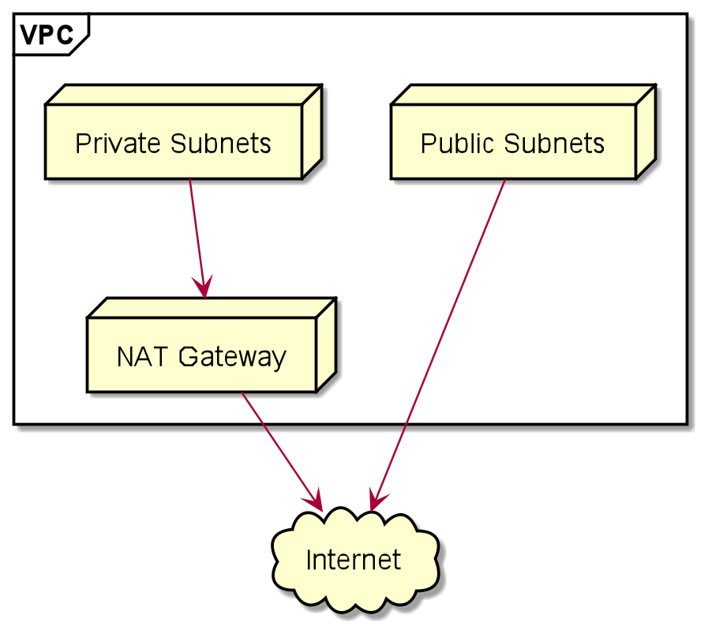

# AWS VPC Terraform module

This is Terraform module for AWS VPC. It follows the following common design of VPC for AWS:
- 3 public subnets in 3 different AZs
- 3 private subnets in 3 different AZs
- NAT gateway for egres communication for private subnets 

  

## License

This project is distributed under [Apache 2.0 license](http://www.apache.org/licenses/LICENSE-2.0.html).